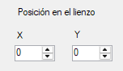

# StickerBoard

## Descripción del proyecto

StickerBoard es una plataforma que le permite al usuario pegar "Stickers" en un lienzo virtual, con la posibilidad de cambiar su tamaño, color y posición de forma exacta.

## Tecnología

Para este proyecto se usó el Framework .NET 4.7.2 para C# en conjunto con las librerías Drawing para el plasmado de las figuras en el lienzo y Microsoft Forms para la UI en general.

## Controles usados

Para la interfaz de usuario se utilizaron los siguientes controles:

+ 1 ComboBox para seleccionar el tipo de figura que se va a utilizar
+ 3 NumberUpDown para permitirle al usuario elegir un número para la posición en X y en Y de su sticker y también para su tamaño.
+ 2 PictureBox, uno para el lienzo (la más grande) y otro para que el usuario elija el color
+ 1 ColorDialog al hacer click en la PictureBox con color rojo mencionada para el color.
+ 2 Buttons: uno para crear el sticker y otro para limpiar el lienzo junto al contador de figuras
+ 1 TextBox de solo lectura para permitir la visualización de la cantidad de figuras del usuario.

## Ejecución

+ Ejecutar StickerBoard:
    Cuando se ejecuta StickerBoard, aparece la interfaz con todos los controles distribuídos y listos para usar. 
+ Seleccionar tipo, posición, tamaño y color:
  + En el panel izquierdo existe la posibilidad para el usuario de cambiar el tipo de figura (Apartado "Tipo de figura") 
     
    Tiene opción de escoger un rectángulo o un círculo. Todas estas figuras son de proporciones predefinidas, por lo que, por ejemplo, el rectángulo siempre tendrá una proporción de tamaño ancho/alto de 2:1 y el círculo de 1:1.
  + También se puede cambiar la posición en el lienzo usando los dos NumberUpDown X y Y.
     
    Un detalle es que la posición definida de la figura escogida siempre será la esquina superior izquierda de la misma. No es necesario usar los pequeños botones, pues también está habilitada la opción de escritura para más agilidad.
  + También está la opción de cambiar el tamaño:
    
    Es más de lo mismo que con la posición, recordando que todas las figuras tienen proporciones predefinidas.
  + Para cambiar el color solo es necesario dar click en la PictureBox roja:
    
    Esto desplegará un menú de selección de color:
    
    Cuando clickees "Aceptar", se asignará el escogido a la nueva figura que vas a crear.
+ Cuando hayas terminado de configurar tu sticker, solo necesitas darle al boton ```Crear```. Esto pegará el sticker en el lienzo.
  + Para ver la cantidad de stickers que hay en el lienzo se  tiene la siguiente TextBox:
    
    Ella se actualiza automáticamente cada que se añade una figura, por eso está en modo solo lectura.
+ Por último, se tiene el botón ```Limpiar```, que deja el lienzo en blanco y regresa el estado del contador ```Cantidad de stickers``` a "0".

## Autores

Santiago Tepud Castaño
Miguel Ángel Zapata Vargas
Grupo 002 - Herramientas de Programación II (ET0051)
Semestre 4

## Casos de prueba

Capturas de la aplicación funcionando.

1. Tipo: Circulo, X = 50, Y = 50, tamaño = 60:
  
2. Tamaño = 0
  
3. Coordenada fuera del lienzo (el NumbersUpDown está limitado al tamaño máximo del lienzo)
  
4. Crear 3 figuras
  
5. Color modificado y nueva figura creada
  
6. Click en limpiar
  
